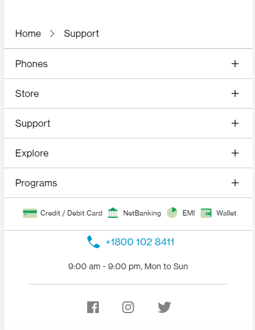
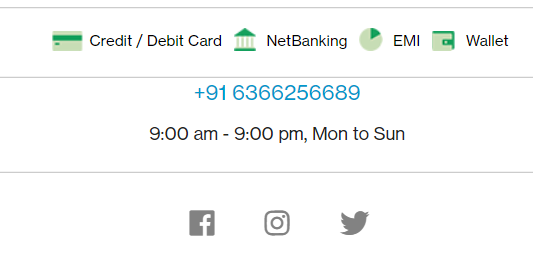
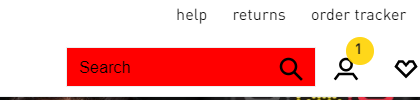

# Dom Manipulation Assignment

1. Webiste Name: [Dev To](https://dev.to/)

### Topics

    - Query Selctory, Inner HTML

### Sample Image

### Tasks

        Target the Top description div and change the DEV Community to <Your_Name> and description to your passion

### Output

## Solution 1

2. Website Name: [Apple](https://support.apple.com/en-in)

### Task

### Fetch all the product name and store in an array

### Output

['iPhone', 'Mac', 'iPad', 'Watch', 'AirPods', 'Music', 'TV']
***
## Solution 2

     - const list = document.querySelectorAll(".main .as-imagegrid .as-imagegrid--7up .row .as-imagegrid-item")

     const products = [];
     for (let element of list) {
     products.push(element.innerText);
     }
     const product = products.map(element => {
     return element.replace("\nSupport"," ");
     });
     product
     ['iPhone ', 'Mac ', 'iPad ', 'Watch ', 'AirPods ', 'Music ', 'TV ']
***
3. Webiste Name: [Youtube Support](https://support.google.com/youtube/)

### Topics

    - Get Element By Id, Create Element, Create Text Node, Append Child

### Sample Image

### Tasks

     Add another FAQ 'My New FAQ' to the list

### Output

---
***
## Solution3

     - const section = document.createElement("section")

       section.setAttribute("id","mySection")

       document.body.querySelector("#hcfe-content .primary-container .page-width-container
       .main-content .article .accordion-homepage").appendChild(section)

      const heading = document.createElement("h3")

      heading.innerHTML = "My New FAQ"

      document.getElementById('mySection').appendChild(heading)

      document.getElementById("mySection").style.borderTop = "1px solid #c9cbca";

      document.querySelector("#mySection").style.padding ="0px"
      '0px'

### SOlution 3 Image
 
***
---

4. Webiste Name: [OnePlus](https://www.oneplus.in/support)

### Topics

     Query Selector, InnerText

### Sample Image

### Tasks

      Change the contact number

### Output

---

## Solution4

     - document.querySelector("#footer
      .container-infinite .container-text .contact-us
      .one-tel-number").innerText = "+91 6366256689"
      '+91 6366256689'

### Solution Image 

---

5. Webiste Name: [Samsung](https://www.samsung.com/in/offer/online/samsung-fest/)

### Topics

       getElementById, createElement, InnerText, append, setAttribute

### Sample Image

### Tasks

     Target the main div of card and change the Button text to Check out

### Output

***
## Solution 5

     const cards =document.querySelectorAll("#smartphone-deals .listing .mytabs .diwali-deals-product-sale-pro .diwali-deals-product-sale-btn")

     for (let element of cards) {
          element.innerHTML = "Check Now";
     }
      'Check Now'

### Solution 5 image 
***
6. Webiste Name: [Adidas](https://www.adidas.co.in/)

### Topics

    -   Query Selector, Event listeners, Changing Styles

### Sample Image

### Tasks

     Target the search box and on hover change thebackground color to red.

### Output

***
## Soluton 6

     let searchBox = document.body.querySelector("#app .gl-app .content-wrapper___1xMQS .sheet___2Zvfp .header___3wNCY .header-desktop___158Zl .glass-header-bottom-desktop-white___2AUaf .right-side-menu___2ykzq .glass-search___X4QNv .searchinput-wrapper___3YrvF .searchinput___19uW0")

      searchBox.addEventListener('mouseover', function(){
        searchBox.style.backgroundColor="red";
      });

### Solution Image 
***
7. Webiste Name: [MDN Web Docs](https://developer.mozilla.org/en-US/)

### Topics

       Form, Value, Submit

### Sample Image

### Tasks

     To Search a topic in the MDN Search bar.
     First add a text to search in the search bar and then hit the submit search button to search the docs using DOM

### Output

---

## Solution 7

     let element = document.getElementById("hp-search-input")
     let btn = document.querySelector("#hp-search-form .search-button");
     element.value = "DOM"
     if (btn) {
     btn.click();
     }

---

8. Webiste Name: [Google](https://www.google.com/)

### Topics

       Remove Elements

### Sample Image

### Tasks

     Remove alternate languages from the home page languages listed

### Output

---

## Solution 8

     let list = document.querySelectorAll("#SIvCob a");
     for (let i = 0; i < list.length; i++) {
     if (i % 2 == 0) {
     list[i].remove();

}
}

### solution Image 

---

9. Webiste Name: [Code Wars](https://www.codewars.com/)

### Topics

       Change Font Family, Color of Text.

### Sample Image

### Tasks

    Change the font family of the text to monospace and text color to the logo’s background color.

### Output

***
## Soluton 9

    let heading = document.querySelector(".content-width-extra-large .display-heading-1");

    heading.style.color = "firebrick";

    heading.style.fontFamily = "monospace";

### Solution 9 Image 

***

10. Webiste Name: [Freecodecamp](https://www.freecodecamp.org/)

### Topics

       querySelector, mouseover, click eventListener,  callback function, style,

### Sample Image

### Tasks

    Target the button and change background colour on mouseover

### Output

***
## Soluton 10

    let element = document.querySelector(".btn-cta-big .login-btn-text");
    element.addEventListener("mouseover",(event) => {event.target.style.backgroundColor = "red"});

### Solution 10 Image 

***

11. Webiste Name: [realme](https://www.realme.com/in/)

### Topics

       querySelector,style,background-image

### Sample Image

### Tasks

    change the realme logo to ineuron logo

### Output

***
## Soluton 11

    let element = document.querySelector(".logo .icon ");
    element.style.backgroundImage = "url('https://ineuron.ai/images/ineuron-logo.png')"

### Solution 11 Image 

***

12. Webiste Name: [Github](https://github.com/)

### Topics

       querySelector,style,background-Color

### Sample Image

### Tasks

     change the background colour of the button to blue.

### Output

***
## Soluton 12

    let btn = document.querySelector(".col-xl-4 .btn");
    btn.style.backgroundColor = "blue"

### Solution 12 Image 

***

13. Webiste Name: [Hackerrank](https://www.hackerrank.com/)

### Topics

       querySelector,innerHtml

### Sample Image

### Tasks

Target the top description and change “Matching developers with great companies” to ‘JSBOOTCAMP“.

### Output

***
## Soluton 13

      document.querySelector(".fl-heading .fl-heading-text").innerHTML = "JSBOOTCAMP";

### Solution 13 Image 

***

14. Webiste Name: [Asus](https://www.asus.com/in/)

### Topics

      querySelector,style,font-size

### Sample Image

### Tasks

       change the fontsize of “Hot Deals” to 80px

### Output

***
## Soluton 14

     document.querySelector(".HotDealsAll__Heading__2fIbe").style.fontSize = "80px";

### Solution 14 Image 

***

15. Webiste Name: [Dell](https://www.dell.com/en-in/shop/deals/laptop-deals?gacd=10415953-9016-5761040-285981356-0&dgc=ST&gclid=Cj0KCQjwguGYBhDRARIsAHgRm4-XUDMhhVNyHXb3s1gY4ZBzORr_d9Se-buhJwy7asyUe7YdqEA11eEaAt6UEALw_wcB&gclsrc=aw.ds&nclid=BxjBlpBQsX6pjSHh-L8YYSU77EpfXRkG1AGMB5Wbeu386ykspfrPDnfx_DdFau20)

### Topics

      querySelector,style.textAlign

### Sample Image

### Tasks

       Convert the text “G15 Gaming Laptop” from left to right

### Output

***
## Soluton 15

        document.querySelector("#d560824win9b .ps-top .ps-title").style.textAlign = "right";

### Solution 15 Image 

***

16. Webiste Name: [Vercel](https://vercel.com/)

### Topics

     querySelector,innerHTMl

### Sample Image

### Tasks

      change the heading “Start with the developer” to “Start with Scratch”

### Output

***
## Soluton 16

     document.querySelector(".section-title_title__VEDfK").innerHTML  = "Start with Scratch";

### Solution 16 Image 

***

17. Webiste Name: [Sony](https://www.sony.co.in/)

### Topics

    querySelector,innerHTMl

### Sample Image

### Tasks

     change the button text To current Date.

### Output

***
## Soluton 17

       let element = document.querySelector(".buy-button .button-and-link-wrapper");

       let today=new Date();

       element.innerHTML = today; 

### Solution 17 Image 

***

18. Webiste Name: [Philips](https://www.philips.co.in/)

### Topics

     querySelector,style,backgroundcolor

### Sample Image

### Tasks

    change the background colour blue to orange

### Output

## Solution 18

        document.querySelector(".footerpage .p-footer-content .globalfooter .p-f03-footer-container").style.background= "#ffc233";

### Solution Image 

19. Webiste Name: [Canon](https://in.canon/)

### Topics

          querySelector,src

### Sample Image

### Tasks

    extract the canon logo

### Output

## Solution 19

     document.querySelector(".navbar-header .logo").src
    'https://in.canon/assets/brandlogo-300-002e45a4aec98fd92899838da9d5560f. png'

20. Webiste Name: [Oppo](https://www.oppo.com/in/)

### Topics

          querySelector,style,color

### Sample Image

### Tasks

      Change the description colour black to orange

### Output

---

## Solution 20

     let desc = document.querySelector(".wide .desc");
     desc.style.color = "Orange";

### Solution Image 

---
